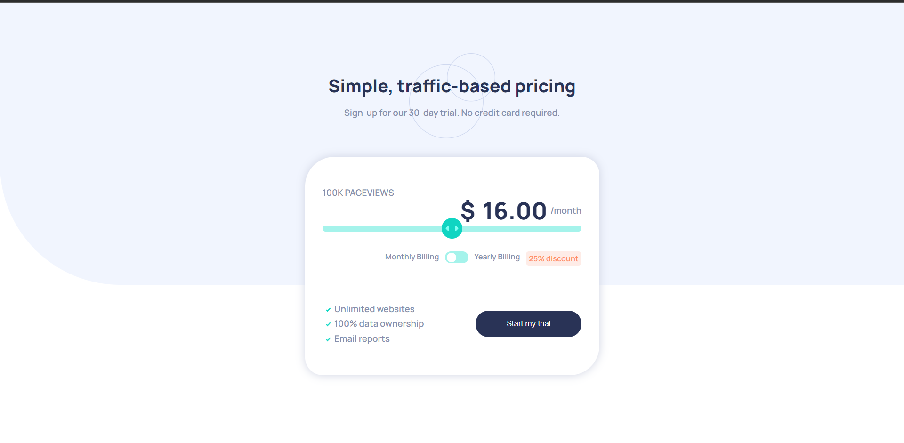

# Frontend Mentor - Interactive pricing component solution

This is a solution to the [Interactive pricing component challenge on Frontend Mentor](https://www.frontendmentor.io/challenges/interactive-pricing-component-t0m8PIyY8).

### Screenshot



### What I learned

```html
<div class="progress">
  <div class="progress-bar">
    <input type="range" min="1" max="5" step="1" value="3" class="myrange" />
  </div>
</div>
```

```css
.myrange::-webkit-slider-thumb {
  -webkit-appearance: none;
  width: 35px;
  height: 35px;
  background-image: url("./images/icon-slider.svg");
  background-repeat: no-repeat;
  background-position: 50% 50%;
  background-color: hsl(174, 86%, 45%);
  border-radius: 50%;
  cursor: pointer;
}

.myrange::-webkit-slider-thumb:hover {
  box-shadow: 0px 0px 10px hsl(174, 86%, 45%);
}
```

```js
switcher.onclick = function () {
  if (myCheckbox.checked == true) {
    let priceInt = parseInt(price.textContent);
    price.textContent = `${(priceInt - priceInt * 0.25) * 12}`;

    duration.textContent = `/year`;
  } else {
    duration.textContent = `/month`;
  }
};
```
